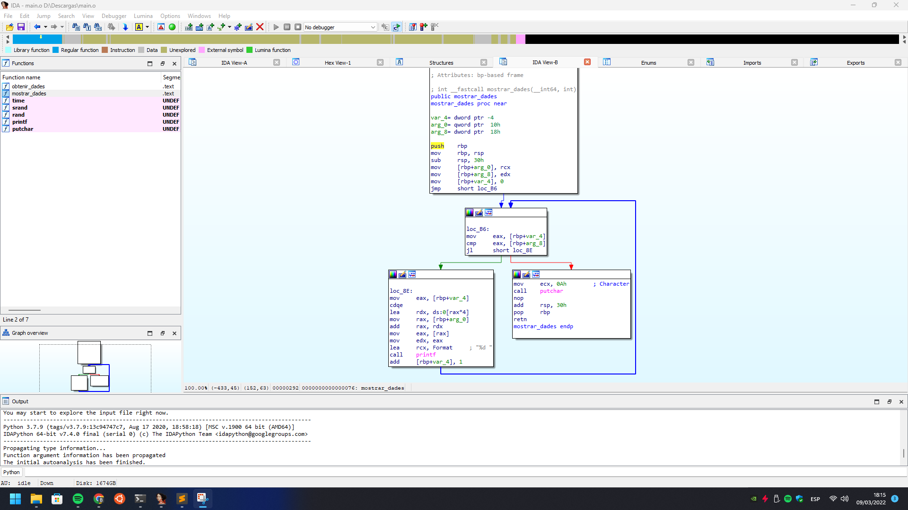
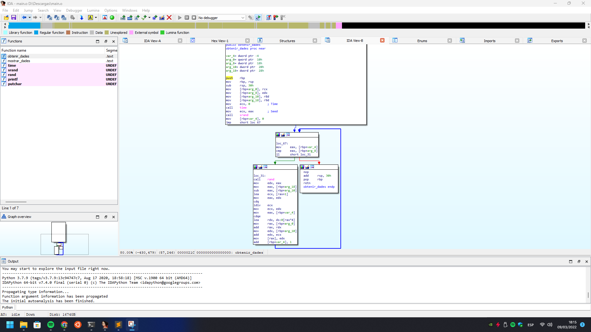

## A reverse engineering journey

#### While ending the practise, a sudden idea came into my mind.
#### What if I tried reverse engineering the provided library file to re-implement the functions as needed by the program?
#### And so I did... ...because that's what a **sane** person would do...
#### I used a **legit**... _wink wink_... IDA Pro with x86(_64) dissasembler (**NOTE:** Hopper, Ghidra or other should be capable too, but I'm most confortable with IDA, after all it's what I've been using for some years already so why change it...).

## This is the assembly code graph for mostrar_dades()

#### At a first glance I identified the typical for() loop graph flow.
#### So that's what I ended up starting with.
#### I thought I could try the function as soon as I coded it, long-story short I couldn't because I forgot that obtenir_dades() comes first and it wasn't implemented so...
#### ...on to implementing the second one (Actually, the first...)...

## This is the assembly code graph for obtenir_dades()

#### Alright alright, this one looks a bit lenghtier than the first one, but the idea is kinda the same:
#### Iterating through the integer array assigning a value (Or printing, in the case of mostrar_dades).
#### So, naturally, I started with a for() loop (After feeding srand with a time 0 struct) and I applied the formula I discovered a few months back in a [Lab practise](https://github.com/cakehonolulu/GTDAWIM/blob/main/FProgI/L5AGE/jocedat.c#L32) instead using function parameters "max" and "min" (NOTE: It appears that the header provided for dades.h has min and max parameters swapped, it was driving me nuts before I found it was a mistake in the header declaration).
#### The rest is pretty self-explanatory, assign to each array index the result of that formula.
#### IDA Pro uses a few strange variables and sometimes function returns (On void types...); my guess is that they're either introduced by compiler optimizations, IDA disassembly inaccuracies or a mix of both. I personally used them until I found out I could optimize them away manually in C code.
#### This is why header files come very in handy... ;)

#### The rest of the project is pretty self explanatory; I crafted a little Makefile that accepts building the hand-made library if compiling on anything different than Windows or use the one provided by the prof. if building using mingw (Or another Compatible Windows C Compiler).
#### It also lets the user decide which compiler to use (I personally love llvm's clang, which I set to default) using make flags (USE_GCC and CCWIN) (CCWIN == Cross Compile WINdows, mingw). Pretty self explanatory stuff.
